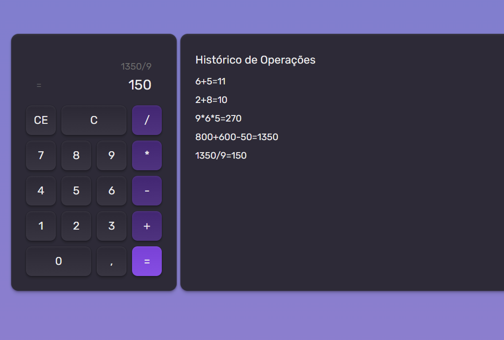

<h1 align="center"> Projeto 1- Calculadora </h1>

  <a href="#-tecnologias">Tecnologias</a>&nbsp;&nbsp;&nbsp;|&nbsp;&nbsp;&nbsp;
  <a href="#-projeto">Projeto</a>&nbsp;&nbsp;&nbsp;|&nbsp;&nbsp;&nbsp;

 

  </a>

## 🚀 Tecnologias

Esse projeto foi desenvolvido com as seguintes tecnologias:

- HTML e CSS
- React + TypeScript

## 💻 Projeto

Nesse módulo, foi construído uma calculadora para exercitar conceitos do React como componentização, propriedades, eventos, estados, condicionais e hooks.

---

Feito por Vinícius Brunheroto :wave: (https://viniciusbrunheroto.github.io/linktree-pessoal/)
